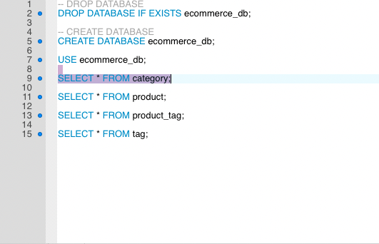

# ORM E-Commerce Back End 

## Task 

To modify starter code by building the back-end for e-commerce site. Configured a fully operating Express.js API and used Sequalize to interact with a MySQL database. 

### Video Demos 

Each video includes a demostration of its functionality. 
Perform RESTful CRUD Operation

[Video Demo Routes for TAGS and CATEGORIES](https://youtu.be/oZ6FMG07cJs) 

[Video Demo Routes for PRODUCT](https://youtu.be/yClEPBldalo) 

### Back-End Developer 

Gina Vargas

   [GitHub](https://github.com/ginavargas1)

   [LinkedIn](www.linkedin.com/in/ginavargas89)

